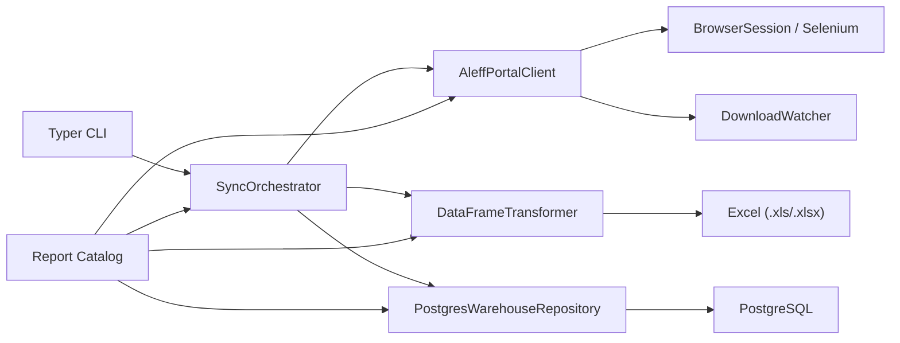
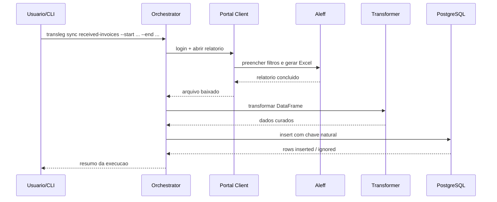
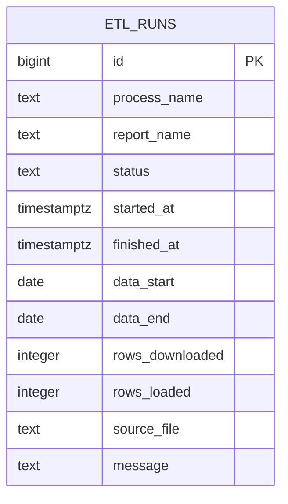

# Transleg

Pipeline de scraping e ingestao analitica para relatorios operacionais e financeiros do portal Aleff, reestruturado com foco em legibilidade, extensibilidade e qualidade de engenharia.

O projeto nasceu a partir de um conjunto de scripts isolados e duplicados. Nesta versao, a ideia central foi transformar o fluxo em um produto de portfolio: arquitetura em camadas, catalogo declarativo de relatorios, transformacoes previsiveis, carga idempotente em PostgreSQL e uma documentacao que deixa claro como a solucao foi pensada.

## O que este projeto demonstra

- Python com separacao explicita entre dominio, aplicacao e infraestrutura.
- Uso pragmatico de SOLID, DRY e KISS sem transformar o projeto em overengineering.
- Automacao de scraping com Selenium em um cliente orientado a fluxo.
- Tratamento de dados tabulares com `pandas`, datas, numeros em locale PT-BR e chaves naturais.
- Persistencia analitica em PostgreSQL com `SQLAlchemy Core` e `ON CONFLICT DO NOTHING`.
- Operacao por CLI, permitindo sincronizacao pontual, incremental e backfill em janelas.

## Arquitetura



## Fluxo de execucao



## Estrutura

```text
Transleg/
|-- README.md
|-- pyproject.toml
|-- sql/
|   `-- schema.sql
|-- src/transleg/
|   |-- application/
|   |-- core/
|   |-- domain/
|   |-- infrastructure/
|   `-- services/
`-- tests/
```

## Decisoes de design

### 1. Catalogo declarativo de relatorios

Os quatro fluxos do projeto original tinham a mesma espinha dorsal: login, navegacao por modulo, preenchimento de datas, pequenos filtros especificos, monitoramento e download do arquivo. Em vez de manter quatro scripts quase iguais, cada relatorio agora e descrito por um `ReportSpec` com:

- ids do menu e do relatorio;
- fragmento da rota;
- descricao esperada no monitor;
- prefixo do arquivo baixado;
- mapeamento de colunas;
- regras de limpeza numerica, datas e inteiros;
- chave natural para deduplicacao.

Isso reduz o custo de manutencao e deixa a adicao de um quinto relatorio trivial.

### 2. Persistencia idempotente

O repositorio cria a tabela de dominio automaticamente quando necessario e aplica `ON CONFLICT DO NOTHING` nas colunas de negocio definidas no catalogo. O efeito pratico e simples:

- reruns nao duplicam linhas;
- backfills podem ser repetidos com seguranca;
- a logica de upsert fica centralizada.

### 3. Transformacao orientada a regras

Cada dataset tem diferencas reais de formato. Em vez de esconder isso em condicionais espalhadas, o transformador recebe a especificacao do relatorio e aplica apenas as regras relevantes:

- trim de strings;
- remocao de linhas vazias e duplicadas;
- conversao de datas com `dayfirst=True`;
- numericos em locale brasileiro para `Decimal`;
- inteiro com clipping em ranges conhecidos;
- descarte de rodapes tecnicos quando o Excel exporta linhas extras.

## Modelo de auditoria



As tabelas de dominio sao criadas dinamicamente a partir do catalogo, com:

- `id` tecnico;
- `loaded_at` para rastreabilidade;
- unique constraint nas chaves naturais do relatorio.

## Como executar

### 1. Preparacao

```bash
cd Transleg
cp .env.example .env
```

Preencha as credenciais do portal e a `TRANSLEG_DATABASE_URL`.

### 2. Instalar dependencias

```bash
uv sync
```

### 3. Listar relatorios disponiveis

```bash
uv run transleg reports
```

### 4. Rodar uma sincronizacao pontual

```bash
uv run transleg sync received-invoices --start 2026-01-01 --end 2026-01-31
```

### 5. Rodar sincronizacao incremental

```bash
uv run transleg incremental payable-titles --default-start 2025-01-01
```

### 6. Rodar backfill em chunks

```bash
uv run transleg backfill payable-titles --start 2024-01-01 --end 2025-12-31 --chunk-days 180
```

## Qualidade e testes

Os testes incluidos cobrem a camada de transformacao e a consistencia do catalogo. Sao justamente as partes que mais sofrem regressao quando um scraping cresce sem disciplina.

```bash
uv run --extra dev pytest
```

## Melhorias futuras

- snapshots de HTML para testes de regressao do scraper;
- camada bronze/silver/gold para analise historica mais sofisticada;
- particionamento por data em tabelas volumosas;
- observabilidade com metricas e alertas;
- execucao agendada com Prefect ou Airflow.

## Comparacao com a versao original

| Tema | Projeto original | Transleg |
|---|---|---|
| Estrutura | Scripts independentes | Pacote `src/` com camadas |
| Reuso | Alto volume de codigo duplicado | Catalogo declarativo de relatorios |
| Persistencia | Script acoplado ao ETL | Repositorio isolado com idempotencia |
| Configuracao | Variaveis soltas | `pydantic-settings` |
| Operacao | Scripts Python avulsos | CLI unica com `sync`, `incremental`, `backfill` |
| Testes | Ausentes | Testes unitarios iniciais |
| Documentacao | Minima | README focado em arquitetura e portifolio |

## Observacoes

- O projeto original `aleff` foi mantido intacto para preservar o historico e facilitar comparacoes.
- `Transleg` nao tenta esconder a natureza fragil do scraping; em vez disso, isola os pontos de acoplamento e deixa explicito onde esta o risco operacional.
- A documentacao assume GitHub como principal vitrine, por isso usa diagramas Mermaid nativos da plataforma.
