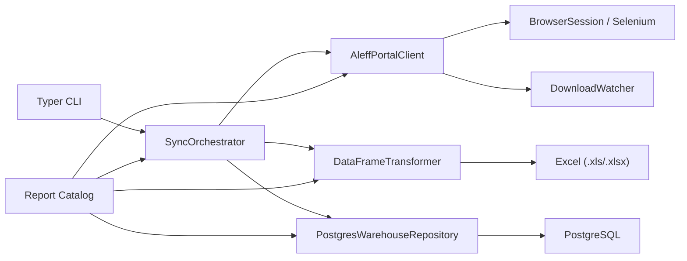
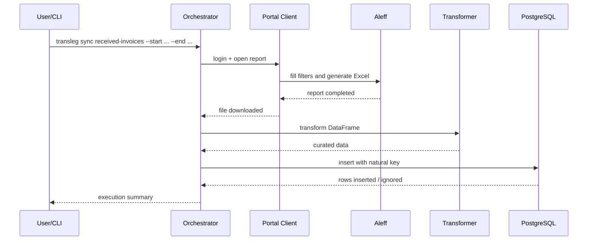
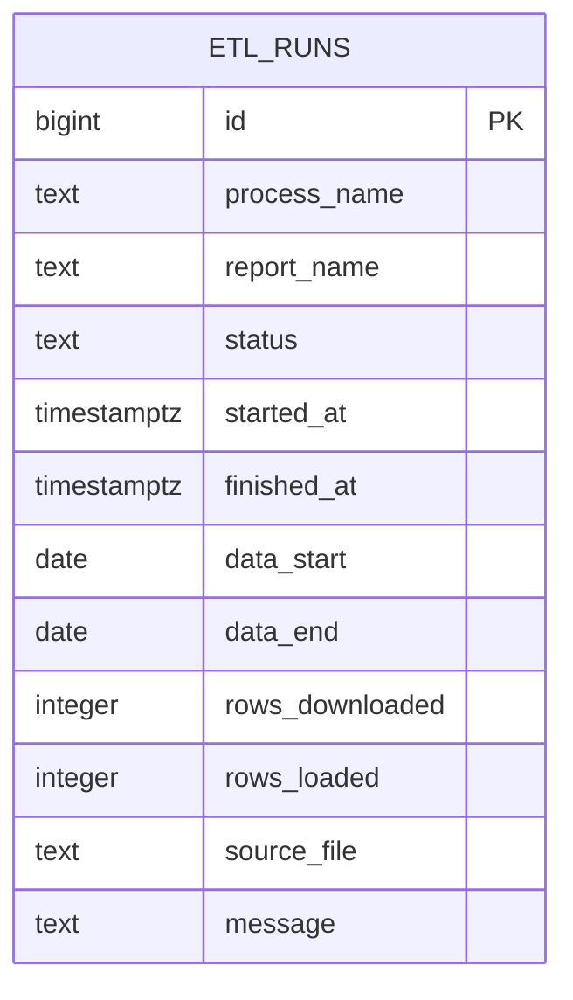

# Transleg

Scraping and analytics ingestion pipeline for operational and financial reports from the Aleff portal, redesigned with a strong focus on readability, extensibility, and engineering quality.

This project started from a set of isolated, highly duplicated scripts. In this version, the main goal was to turn that flow into a portfolio-grade project: layered architecture, a declarative report catalog, predictable data transformations, idempotent PostgreSQL loading, and documentation that makes the design decisions explicit.

## What this project demonstrates

- Python with explicit separation between domain, application, and infrastructure layers.
- Pragmatic use of SOLID, DRY, and KISS without turning the project into overengineering.
- Scraping automation with Selenium through a flow-oriented client.
- Tabular data processing with `pandas`, date parsing, PT-BR locale numeric normalization, and natural keys.
- Analytical persistence in PostgreSQL with `SQLAlchemy Core` and `ON CONFLICT DO NOTHING`.
- CLI-based operation for point-in-time syncs, incremental loads, and backfills in chunks.

## Architecture



## Execution flow



## Project structure

```text
Transleg/
|-- README.md
|-- pyproject.toml
|-- sql/
|   `-- schema.sql
|-- src/transleg/
|   |-- application/
|   |-- core/
|   |-- domain/
|   |-- infrastructure/
|   `-- services/
`-- tests/
```

## Design decisions

### 1. Declarative report catalog

The four flows from the original project shared the same backbone: login, module navigation, date input, a few report-specific filters, monitoring, and file download. Instead of keeping four nearly identical scripts, each report is now described by a `ReportSpec` with:

- menu and report ids;
- route fragment;
- expected description in the monitor screen;
- downloaded file prefix;
- column mapping;
- numeric, date, and integer cleaning rules;
- natural key for deduplication.

This reduces maintenance cost and makes adding a fifth report straightforward.

### 2. Idempotent persistence

The repository creates the domain table automatically when needed and applies `ON CONFLICT DO NOTHING` on the business columns defined in the catalog. In practice, this means:

- reruns do not duplicate rows;
- backfills can be repeated safely;
- upsert-like behavior stays centralized.

### 3. Rule-driven transformation

Each dataset has real formatting differences. Instead of hiding that in scattered conditionals, the transformer receives the report specification and applies only the relevant rules:

- string trimming;
- removal of empty rows and duplicates;
- date conversion with `dayfirst=True`;
- Brazilian locale numeric normalization into `Decimal`;
- integer coercion with clipping to known ranges;
- removal of technical footer rows when the exported Excel includes them.

## Audit model



Domain tables are created dynamically from the catalog, with:

- a technical `id`;
- `loaded_at` for traceability;
- a unique constraint on the report natural keys.

## How to run

### 1. Setup

```bash
cd Transleg
cp .env.example .env
```

Fill in the portal credentials and `TRANSLEG_DATABASE_URL`.

### 2. Install dependencies

```bash
uv sync
```

### 3. List available reports

```bash
uv run transleg reports
```

### 4. Run a point-in-time sync

```bash
uv run transleg sync received-invoices --start 2026-01-01 --end 2026-01-31
```

### 5. Run an incremental sync

```bash
uv run transleg incremental payable-titles --default-start 2025-01-01
```

### 6. Run a chunked backfill

```bash
uv run transleg backfill payable-titles --start 2024-01-01 --end 2025-12-31 --chunk-days 180
```

## Quality and tests

The included tests cover the transformation layer and catalog consistency. Those are exactly the areas most likely to regress when a scraping project grows without discipline.

```bash
uv run --extra dev pytest
```

## Future improvements

- HTML snapshots for scraper regression tests;
- bronze/silver/gold layering for more advanced historical analytics;
- partitioning for large date-based tables;
- observability with metrics and alerts;
- scheduled execution with Prefect or Airflow.
